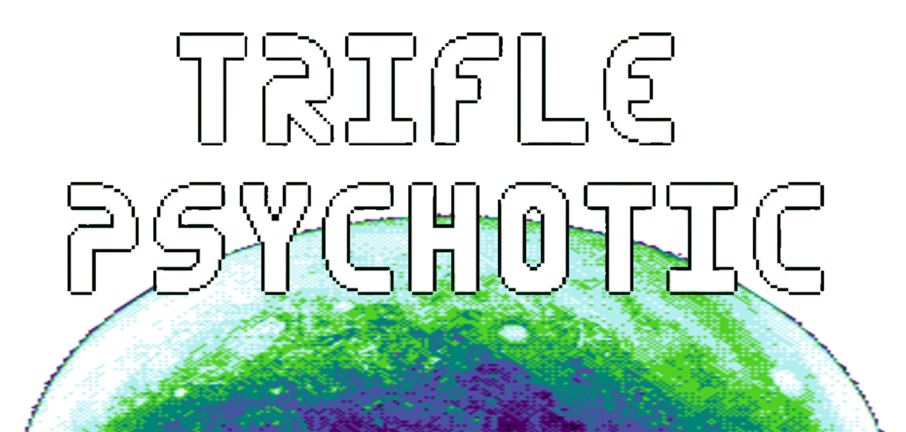

<p align="center">
  
</p>

---

**Trifle Psychotic** is a retro sci-fi platformer written in C. This repository contains the native PlayStation Vita port, built using SDL2 and tailored for the console's GXM rendering backend.

## Download & Install

You can download the latest playable PlayStation Vita build (`.vpk`) directly from the [Releases](../../releases) page. 

Simply install the `.vpk` file using VitaShell.

## Screenshots

<p align="center">
  
  
</p>

## Credits

This port is based on the original game developed by **Jan Orzechowski**. 

* **Original Game (Play/Download):** [janorzechowski.itch.io/trifle-psychotic](https://janorzechowski.itch.io/trifle-psychotic)
* **Author's Website:** [janorzechowski.com](https://janorzechowski.com/)
* **Original Architecture Overview:** [ARCHITECTURE.md](https://github.com/jan-orzechowski/trifle-psychotic/blob/main/ARCHITECTURE.md)

Graphical, audio, and level assets remain the property of their respective creators. 

## License

The game's source code is released under the **zlib license**.

The game's assets are under different licenses:
* Levels' data (`.tmx` files in the `data` folder) is licensed under Creative Commons Attribution-NonCommercial-ShareAlike 3.0 Unported (CC BY-NC-SA 3.0), with attribution to Jan Orzechowski, 2022. 
* Graphical and audio assets are under licenses chosen by their respective creators (check the `credits` files in the `audio` and `gfx` folders).

## Building from source (PS Vita)

To compile the PS Vita port yourself, you will need the [VitaSDK](https://vitasdk.org/) properly installed and configured.

The project relies on standard Vita SDL2 libraries. Create a build directory and use the Vita CMake toolchain:

```bash
mkdir build && cd build
cmake ..
make -j$(nproc)
